# AI WorkBench 内置工作流流程图全景

> 版本：2026-05-02 v1.0
> 适用引擎：Go 原生 DAG 引擎（20 种节点类型）
> Prompt 外化：所有 LLM 节点的 `system_prompt` 已外化为 `api/assets/prompts/<workflow>_<node>.txt`，可单独迭代

---

## 0. 总览

### 0.1 工作流分类（30 个）

| 分类 | 数量 | 工作流名 |
|------|------|---------|
| **诊断** | 10 | diagnosis / smart_diagnosis / alert_diagnosis / domain_diagnosis / container_diagnosis / jvm_diagnosis / db_lock_analysis / slow_query_diagnosis / log_analysis / incident_postmortem |
| **巡检** | 7 | health_inspection / business_inspection / dependency_health / storage_health_check / middleware_inspection / network_check / incident_review |
| **分析** | 6 | metrics_insight / metrics_analysis / capacity_forecast / slo_compliance / traffic_anomaly_detect / incident_timeline |
| **安全** | 4 | security_compliance / security_audit / ssl_audit / config_drift_detect |
| **操作** | 3 | runbook_execute / change_rollback / knowledge_enrich |

### 0.2 节点类型图例

| 节点类型 | 图标 | 作用 |
|---------|------|------|
| `start/end` | 圆角 | 工作流起止 |
| `http_request` | 矩形 | 调用内部 REST API（如 `/api/v1/prometheus/metrics`） |
| `knowledge_retrieval` | 平行四边形 | BM25 + 向量 + RRF + Reranker 检索历史案例 |
| `code` | 六边形 | JS 沙箱（goja）执行算法（聚合/异常检测/时间线合并） |
| `llm` | 椭圆 | 调用 LLM（system_prompt 已外化为 `prompts/*.txt`） |
| `agent` | 双圆 | Reasoning Agent（带工具调用） |
| `condition` | 菱形 | 条件分支 |
| `loop` | 圆柱 | 循环子工作流 |
| `parameter_extractor` | 梯形 | 从输入抽取结构化参数 |

### 0.3 通用约定

- **并行组**：标记 `parallel_group` 的节点会被引擎同时调度，WaitGroup 同步后进入下一节点
- **Fallback 降级**：节点配置 `fallback.on_error: continue` 时返回 `fallback_value` 不阻断
- **Prompt 文件路径**：所有 `system_prompt: "file://prompts/xxx.txt"` 相对于 `api/assets/` 解析
- **触发方式**：手动（前端）/ 告警（webhook → 智能路由）/ 定时（cron 调度器）/ 编排（被其他工作流引用）

---

## 一、诊断类（10 个）

### 1. `diagnosis` — AIOps 智能诊断（核心入口）

**用途**：综合多源数据 + 历史案例的根因诊断
**触发**：手动 / 编排（智能路由默认入口）

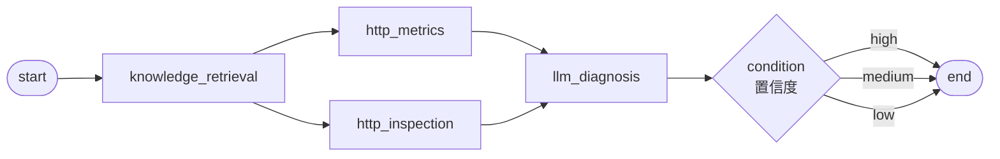

**数据流表**：
| 节点 | 类型 | 数据来源 | 数据去向 |
|------|------|---------|---------|
| `knowledge_retrieval` | knowledge_retrieval | `start.user_question + start.hostname` | Top3 历史案例 → `llm_diagnosis` |
| `http_metrics` | http_request | `/api/v1/prometheus/metrics?ip={hostname}` | 实时指标 → `llm_diagnosis` |
| `http_inspection` | http_request | `/api/v1/alerts?ip={hostname}&limit=10` | 最近告警 → `llm_diagnosis` |
| `llm_diagnosis` | llm | 上述三路输入 | JSON 诊断结果 → `condition` |
| `condition` | condition | `llm_diagnosis.confidence` | 三向分流到 end |

**LLM 角色**：`prompts/diagnosis_system.txt`
- 资深 SRE，输出结构化 JSON：`{root_cause, evidence, treatment, confidence}`
- temperature=0.1，json_mode=true，max_tokens=2000

---

### 2. `smart_diagnosis` — 智能诊断（带 Runbook 推荐）

**用途**：诊断 + 自动匹配 Runbook，支持告警和手动触发
**触发**：手动 / 告警 webhook

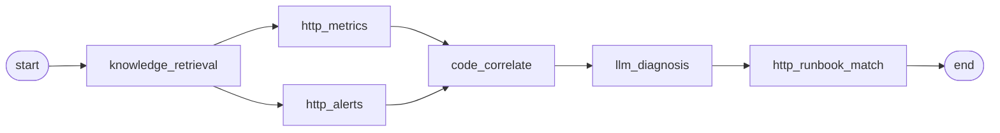

**数据流表**：
| 节点 | 类型 | 数据来源 | 数据去向 |
|------|------|---------|---------|
| `knowledge_retrieval` | knowledge_retrieval | 用户问题 + 主机 | 历史案例 → `llm_diagnosis` |
| `http_metrics` | http_request | Prometheus 指标 API | `code_correlate.metrics` |
| `http_alerts` | http_request | 告警 API | `code_correlate.alerts` |
| `code_correlate` | code（JS 沙箱） | 指标 + 告警 | 5 维阈值检测 + 关联分析 → `llm_diagnosis` |
| `llm_diagnosis` | llm | 关联结果 + 历史案例 | Markdown 报告 → `http_runbook_match` |
| `http_runbook_match` | http_request | `/api/v1/runbooks/match` | 推荐 Runbook → `end` |

**关联规则**（`code_correlate`）：
- CPU>70 + IO>70 → 「大查询/批处理」
- MEM>80 + Swap>50 → 「内存泄漏」
- CPU>90 + MEM>90 → 「资源严重不足」
- 阈值：cpu_usage_active(70/90) / mem_used_percent(80/95) / disk_used_percent(80/90) / disk_io_util(70/90) / load1_per_cpu(0.7/1.0)

**LLM 角色**：`prompts/smart_diagnosis_llm_diagnosis.txt`
- 资深 SRE，USE 方法论（Utilization/Saturation/Errors）
- 输出 5 段 Markdown：摘要表 / Prometheus 证据表 / 根因 / 处置 / PromQL 验证
- temperature=0.05，禁止编造指标

---

### 3. `alert_diagnosis` — 告警驱动自动诊断

**用途**：告警接入后自动触发的根因分析
**触发**：告警 webhook（智能路由）

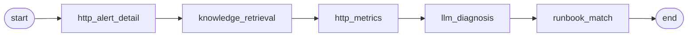

**数据流表**：
| 节点 | 类型 | 数据来源 | 数据去向 |
|------|------|---------|---------|
| `http_alert_detail` | http_request | `/api/v1/alerts/:id` | 告警详情 → `knowledge_retrieval / llm` |
| `knowledge_retrieval` | knowledge_retrieval | 告警标题 + 标签 | 相似历史案例 |
| `http_metrics` | http_request | Prometheus 指标 | LLM 输入 |
| `llm_diagnosis` | llm | 告警 + 指标 + 案例 | JSON 诊断 |
| `runbook_match` | http_request | `/api/v1/runbooks/match` | 推荐 Runbook 类别 |

**LLM 角色**：`prompts/alert_diagnosis_llm_diagnosis.txt`
- 资深运维，处理告警场景
- 输出 JSON：`{root_cause, root_cause_category, evidence[], treatment[], confidence, recommended_runbook_category}`

---

### 4. `domain_diagnosis` — 专项诊断

**用途**：按 domain 参数（network/disk/cpu/mem/jvm/container/db/log）切换专家分析链路
**触发**：手动 / 智能路由（按 domain 关键词匹配）

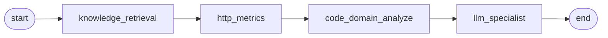

**数据流表**：
| 节点 | 类型 | 数据来源 | 数据去向 |
|------|------|---------|---------|
| `knowledge_retrieval` | knowledge_retrieval | 问题 + domain 关键词 | 专项案例 |
| `http_metrics` | http_request | Prometheus（按 domain 选指标） | `code_domain_analyze` |
| `code_domain_analyze` | code | 原始指标 | 专项预处理（如 GC/IO/锁等待） → LLM |
| `llm_specialist` | llm | 专项分析结果 | 专家诊断报告 |

**LLM 角色**：`prompts/domain_diagnosis_llm_specialist.txt`
- 多领域专家切换（按 domain 注入角色），统一输出格式

---

### 5. `container_diagnosis` — K8s/容器诊断

**用途**：Pod/Deployment 故障根因（OOMKilled / CrashLoopBackOff / Pending）
**触发**：手动 / 告警（K8s 类告警）

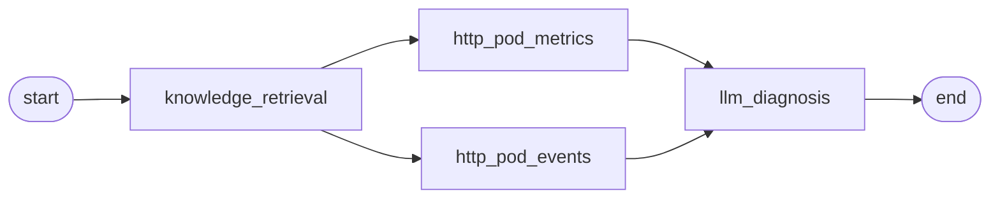

**数据流表**：
| 节点 | 类型 | 数据来源 | 数据去向 |
|------|------|---------|---------|
| `http_pod_metrics` | http_request | Pod 指标 API | 资源使用 → LLM |
| `http_pod_events` | http_request | K8s 事件 API | 事件序列 → LLM |
| `llm_diagnosis` | llm | 指标 + 事件 + 案例 | 容器诊断 |

**LLM 角色**：`prompts/container_diagnosis_llm_diagnosis.txt`
- K8s 专家，识别 OOMKilled / CrashLoop / ImagePullBackOff / Pending 等典型问题

---

### 6. `jvm_diagnosis` — JVM 专项诊断

**用途**：Java 应用 GC / 内存 / 线程问题
**触发**：手动 / 告警（JVM 类）

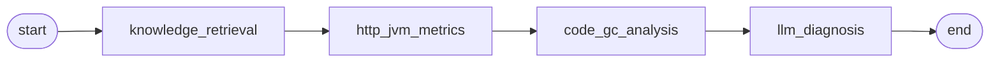

**数据流表**：
| 节点 | 类型 | 数据来源 | 数据去向 |
|------|------|---------|---------|
| `http_jvm_metrics` | http_request | JVM Exporter | 堆/GC/线程指标 |
| `code_gc_analysis` | code | JVM 指标 | YoungGC/FullGC 频率 + 停顿统计 |
| `llm_diagnosis` | llm | GC 分析 + 案例 | 调优建议 |

**LLM 角色**：`prompts/jvm_diagnosis_llm_diagnosis.txt`
- JVM 调优专家，输出 JVM 参数建议、内存泄漏识别、线程死锁诊断

---

### 7. `db_lock_analysis` — MySQL 死锁分析

**用途**：死锁/长事务/锁等待诊断
**触发**：手动 / 告警（DB 类）

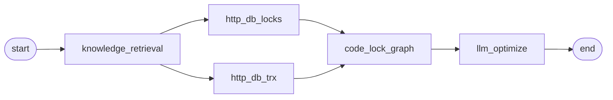

**数据流表**：
| 节点 | 类型 | 数据来源 | 数据去向 |
|------|------|---------|---------|
| `http_db_locks` | http_request | `information_schema.innodb_locks` | 锁信息 |
| `http_db_trx` | http_request | `information_schema.innodb_trx` | 事务列表 |
| `code_lock_graph` | code | 锁 + 事务 | 构建锁等待图 → 检测死锁环 |
| `llm_optimize` | llm | 锁图 + 案例 | SQL 优化建议 |

**LLM 角色**：`prompts/db_lock_analysis_llm_optimize.txt`
- DBA 专家，输出索引设计、SQL 重写、隔离级别建议

---

### 8. `slow_query_diagnosis` — 慢查询诊断

**用途**：MySQL 慢查询根因 + 优化方案
**触发**：手动 / 定时

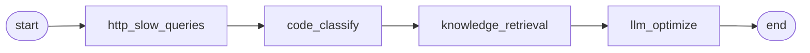

**数据流表**：
| 节点 | 类型 | 数据来源 | 数据去向 |
|------|------|---------|---------|
| `http_slow_queries` | http_request | 慢查询日志 API | 慢 SQL 列表 |
| `code_classify` | code | 慢 SQL | 按表/类型分类（全表扫描/索引缺失/JOIN/排序） |
| `knowledge_retrieval` | knowledge_retrieval | 分类结果 | 类似案例 |
| `llm_optimize` | llm | 分类 + 案例 | 索引/SQL 优化建议 |

**LLM 角色**：`prompts/slow_query_diagnosis_llm_optimize.txt`
- DBA，输出 EXPLAIN 解读、索引建议、SQL 重写

---

### 9. `log_analysis` — 日志分析

**用途**：从日志中提取错误模式 + 根因分析
**触发**：手动 / 编排

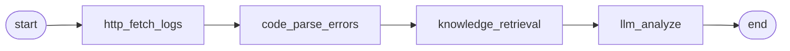

**数据流表**：
| 节点 | 类型 | 数据来源 | 数据去向 |
|------|------|---------|---------|
| `http_fetch_logs` | http_request | 日志 API | 原始日志 |
| `code_parse_errors` | code | 日志文本 | 正则提取 ERROR/WARN/Exception → 聚类 |
| `knowledge_retrieval` | knowledge_retrieval | 错误模式 | 类似案例 |
| `llm_analyze` | llm | 错误聚类 + 案例 | 根因分析 |

**LLM 角色**：`prompts/log_analysis_llm_analyze.txt`
- 日志分析专家，识别异常堆栈、错误根因、关联事件

---

### 10. `incident_postmortem` — 故障复盘（5-Why）

**用途**：故障结束后自动生成 5-Why 复盘报告
**触发**：手动（故障归档后）

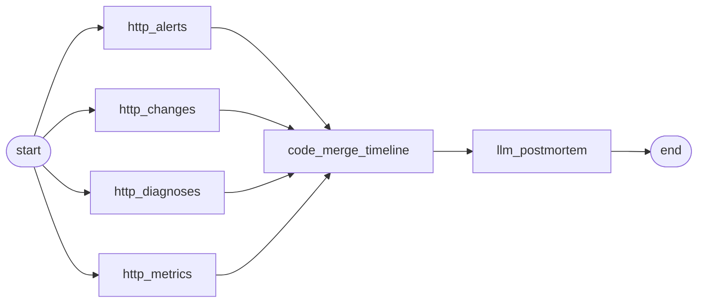

**数据流表**：
| 节点 | 类型 | 数据来源 | 数据去向 |
|------|------|---------|---------|
| `http_alerts ∥ http_changes ∥ http_diagnoses ∥ http_metrics` | 4 路并行 http_request | 告警/变更/诊断/指标 API | 时间窗口数据 |
| `code_merge_timeline` | code | 4 路数据 | 合并为统一时间线 |
| `llm_postmortem` | llm | 时间线 | 5-Why 复盘 |

**LLM 角色**：`prompts/incident_postmortem_llm_postmortem.txt`
- 故障复盘专家，输出 JSON：`{incident_title, duration_minutes, mttr_minutes, five_whys[], root_cause, action_items[], summary}`

---

## 二、巡检类（7 个）

### 11. `health_inspection` — 健康巡检（多维度）

**用途**：多维度并行探活 + 综合健康评估
**触发**：手动 / 定时（默认 6h）

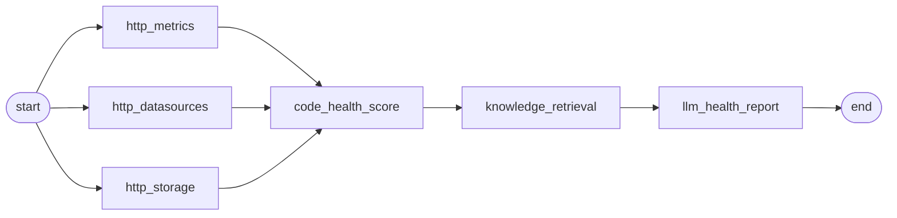

**数据流表**：
| 节点 | 类型 | 数据来源 | 数据去向 |
|------|------|---------|---------|
| `http_metrics ∥ http_datasources ∥ http_storage` | 3 路并行 | 指标/数据源/存储健康 API | 聚合 |
| `code_health_score` | code | 3 路数据 | 加权评分 0-100 |
| `knowledge_retrieval` | knowledge_retrieval | 低分项 | 历史解决方案 |
| `llm_health_report` | llm | 评分 + 案例 | 健康报告（含建议） |

**LLM 角色**：`prompts/health_inspection_llm_health_report.txt`
- 资深运维，输出健康评估 Markdown（含整改优先级）

---

### 12. `business_inspection` — 业务巡检

**用途**：按业务拓扑批量巡检所有主机
**触发**：手动 / 定时

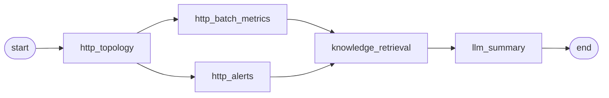

**数据流表**：
| 节点 | 类型 | 数据来源 | 数据去向 |
|------|------|---------|---------|
| `http_topology` | http_request | `/api/v1/topology/businesses/:id` | 业务拓扑 |
| `http_batch_metrics ∥ http_alerts` | 并行 | 批量指标 + 告警 | 聚合 |
| `knowledge_retrieval` | knowledge_retrieval | 异常项 | 案例 |
| `llm_summary` | llm | 全部数据 | 业务健康综合评估 |

**LLM 角色**：`prompts/business_inspection_llm_summary.txt`
- 业务运维专家，按拓扑层次输出评估（入口/应用/DB/中间件）

---

### 13. `dependency_health` — 依赖健康巡检

**用途**：DB/Redis/MQ 核心依赖探活
**触发**：手动 / 定时

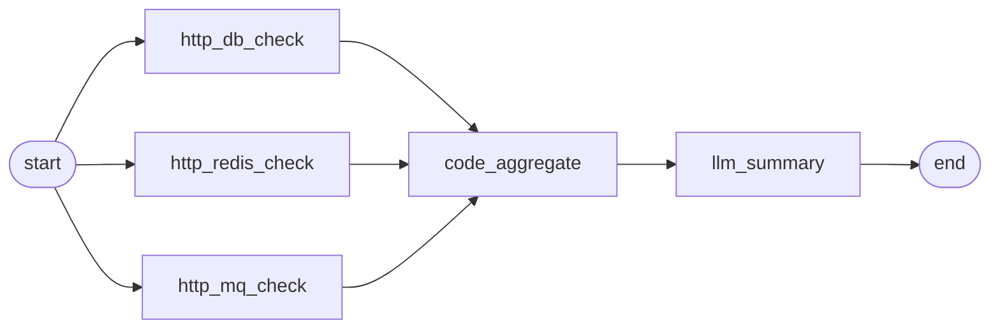

**LLM 角色**：`prompts/dependency_health_llm_summary.txt` — 依赖巡检专家，按依赖类型分段总结

---

### 14. `storage_health_check` — 存储健康检查

**用途**：磁盘/NFS/OSS 存储状态巡检
**触发**：手动 / 定时

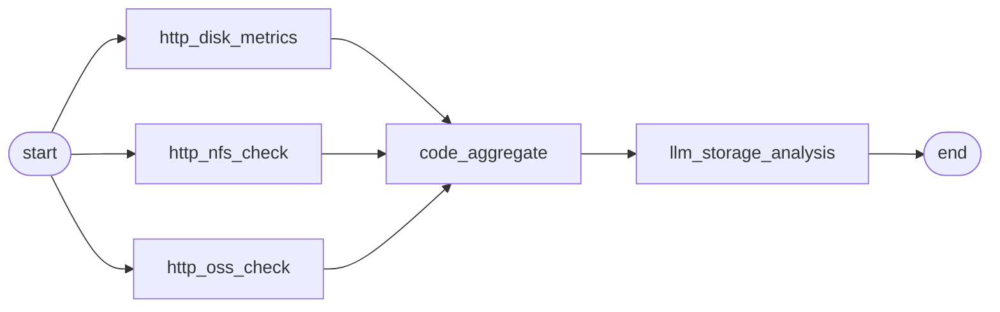

**LLM 角色**：`prompts/storage_health_check_llm_storage_analysis.txt` — 存储专家，输出容量/IO/错误分析

---

### 15. `middleware_inspection` — 中间件巡检

**用途**：Kafka/RabbitMQ/ES 中间件健康巡检
**触发**：手动 / 定时

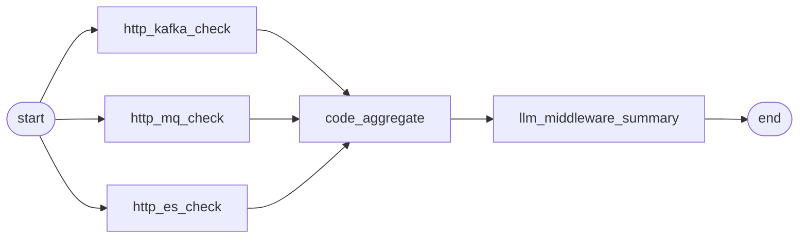

**LLM 角色**：`prompts/middleware_inspection_llm_middleware_summary.txt` — 中间件运维专家，按类型输出评估

---

### 16. `network_check` — 网络连通性检测

**用途**：业务拓扑端点间连通性检测
**触发**：手动

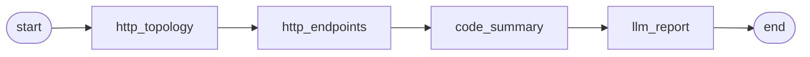

**数据流表**：
| 节点 | 类型 | 数据来源 | 数据去向 |
|------|------|---------|---------|
| `http_topology` | http_request | 拓扑 API | 端点列表 |
| `http_endpoints` | http_request | 批量 tcping/http check | 连通性矩阵 |
| `code_summary` | code | 矩阵 | 失败端点聚类 |
| `llm_report` | llm | 矩阵 + 聚类 | 网络问题定位 |

**LLM 角色**：`prompts/network_check_llm_report.txt` — 网络专家，输出连通性报告（含故障路径）

---

### 17. `incident_review` — 故障回顾

**用途**：多源数据重建故障时间线 + 复盘
**触发**：手动

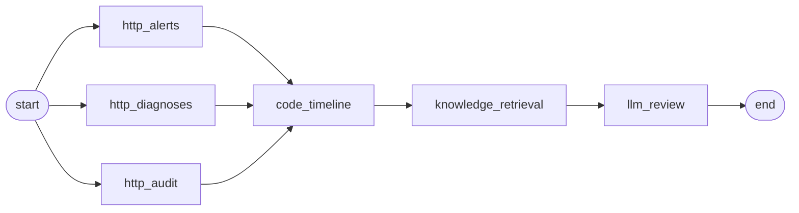

**LLM 角色**：`prompts/incident_review_llm_review.txt` — 复盘专家，输出时间线叙事 + 经验教训

---

## 三、分析类（6 个）

### 18. `metrics_insight` — 指标洞察

**用途**：多维度指标分析（异常 + 趋势 + 容量）
**触发**：手动 / 定时

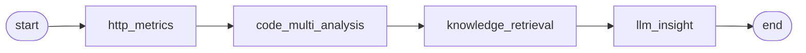

**`code_multi_analysis` 算法**：调用 Go 时序分析引擎（z-score 异常 + 线性回归趋势 + CUSUM 突变 + 简单容量预测）

**LLM 角色**：`prompts/metrics_insight_llm_insight.txt` — 指标分析专家

---

### 19. `metrics_analysis` — Prometheus 深度指标分析

**用途**：针对指定指标做深度分析 + 异常检测
**触发**：手动

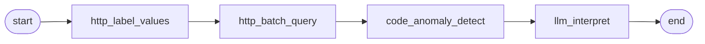

**数据流表**：
| 节点 | 类型 | 数据来源 | 数据去向 |
|------|------|---------|---------|
| `http_label_values` | http_request | Prometheus label_values API | 标签枚举 |
| `http_batch_query` | http_request | `query_range` 批量 | 时序数据 |
| `code_anomaly_detect` | code | 时序 | z-score 异常点 |
| `llm_interpret` | llm | 异常点 | 解读报告 |

**LLM 角色**：`prompts/metrics_analysis_llm_interpret.txt` — Prometheus 专家

---

### 20. `capacity_forecast` — 容量预测

**用途**：基于历史趋势做容量预测
**触发**：手动 / 定时（周度）

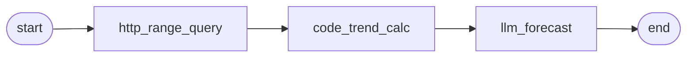

**`code_trend_calc` 算法**：最小二乘法线性回归 → 外推未来 N 天

**LLM 角色**：`prompts/capacity_forecast_llm_forecast.txt` — 容量规划专家，输出预测 + 扩容建议

---

### 21. `slo_compliance` — SLO 达标分析

**用途**：SLI 指标 + Error Budget 计算 + LLM 评估
**触发**：手动 / 定时（日度）

```mermaid
flowchart LR
  start([start]) --> hsm[http_sli_metrics]
  hsm --> cbc[code_budget_calc]
  cbc --> kr[knowledge_retrieval]
  kr --> llm[llm_slo_analysis]
  llm --> endNode([end])
```

**`code_budget_calc` 算法**：计算当前 SLI、Error Budget 消耗率、预测耗尽时间

**LLM 角色**：`prompts/slo_compliance_llm_slo_analysis.txt` — SRE/SLO 专家

---

### 22. `traffic_anomaly_detect` — 流量异常检测

**用途**：当前流量 vs 历史基线的异常检测
**触发**：手动 / 定时

```mermaid
flowchart LR
  start([start]) --> hct[http_current_traffic]
  start --> hbt[http_baseline_traffic]
  hct --> cas[code_anomaly_score]
  hbt --> cas
  cas --> kr[knowledge_retrieval]
  kr --> llm[llm_anomaly_analysis]
  llm --> endNode([end])
```

**`code_anomaly_score` 算法**：z-score（`(current - baseline_mean) / baseline_std`）

**LLM 角色**：`prompts/traffic_anomaly_detect_llm_anomaly_analysis.txt` — 流量分析专家

---

### 23. `incident_timeline` — 故障时间线重建

**用途**：多源数据合并为统一时间线叙事
**触发**：手动

```mermaid
flowchart LR
  start([start]) --> ha[http_alerts]
  start --> hd[http_diagnoses]
  start --> hau[http_audit]
  ha --> cmt[code_merge_timeline]
  hd --> cmt
  hau --> cmt
  cmt --> llm[llm_narrative]
  llm --> endNode([end])
```

**LLM 角色**：`prompts/incident_timeline_llm_narrative.txt` — 故障叙事专家，输出按时间顺序的事件叙事

---

## 四、安全类（4 个）

### 24. `security_compliance` — 安全合规

**用途**：审计事件 + 风险评分 + LLM 深度分析
**触发**：手动 / 定时

```mermaid
flowchart LR
  start([start]) --> hae[http_audit_events]
  hae --> crs[code_risk_score]
  crs --> kr[knowledge_retrieval]
  kr --> llm[llm_security_analysis]
  llm --> endNode([end])
```

**LLM 角色**：`prompts/security_compliance_llm_security_analysis.txt` — 安全合规专家

---

### 25. `security_audit` — 安全审计（条件分流）

**用途**：审计事件评分后按风险分流，仅高风险触发 LLM 深度分析（节省成本）
**触发**：手动 / 定时

```mermaid
flowchart LR
  start([start]) --> hae[http_audit_events]
  hae --> crs[code_risk_score]
  crs --> cond{condition}
  cond -->|high_risk| llm[llm_deep_analysis]
  cond -->|low_risk| endSafe([end_safe])
  llm --> endRisk([end_risk])
```

**LLM 角色**：`prompts/security_audit_llm_deep_analysis.txt` — 安全审计专家（仅高风险）

---

### 26. `ssl_audit` — SSL 证书审计（含 loop）

**用途**：循环检查所有域名的 SSL 证书有效期/算法/链完整性
**触发**：手动 / 定时（周度）

```mermaid
flowchart LR
  start([start]) --> hel[http_endpoint_list]
  hel --> lc[loop_check]
  lc --> cs[code_summary]
  cs --> llm[llm_report]
  llm --> endNode([end])
```

**数据流表**：
| 节点 | 类型 | 数据来源 | 数据去向 |
|------|------|---------|---------|
| `http_endpoint_list` | http_request | 域名列表 API | 循环输入 |
| `loop_check` | loop | 每个域名执行 http_request 检查证书 | 结果数组 |
| `code_summary` | code | 结果数组 | 过期/即将过期统计 |
| `llm_report` | llm | 统计 + 风险项 | 审计报告 |

**LLM 角色**：`prompts/ssl_audit_llm_report.txt` — SSL/TLS 专家，输出过期风险 + 换证优先级

---

### 27. `config_drift_detect` — 配置漂移检测

**用途**：运行时配置 vs 基线配置的 diff 检测
**触发**：手动 / 定时

```mermaid
flowchart LR
  start([start]) --> hrc[http_running_config]
  start --> hbc[http_baseline_config]
  hrc --> cdc[code_diff_calc]
  hbc --> cdc
  cdc --> llm[llm_risk_assess]
  llm --> endNode([end])
```

**LLM 角色**：`prompts/config_drift_detect_llm_risk_assess.txt` — 配置管理专家，评估漂移风险

---

## 五、操作类（3 个）

### 28. `runbook_execute` — Runbook 安全执行

**用途**：从 Runbook 提取命令 → 安全校验 → 自动执行 OR 要求人工确认
**触发**：手动 / 编排（如 `alert_diagnosis` 后置动作）

```mermaid
flowchart LR
  start([start]) --> hrd[http_runbook_detail]
  hrd --> cv[code_validate]
  cv --> ce{condition_exec}
  ce -->|can_auto_execute| ae[agent_execute]
  ce -->|manual_required| em([end_manual])
  ae --> ee([end_executed])
```

**数据流表**：
| 节点 | 类型 | 数据来源 | 数据去向 |
|------|------|---------|---------|
| `http_runbook_detail` | http_request | `/api/v1/knowledge/runbooks/:id` | Runbook 命令 |
| `code_validate` | code | 命令 | L0-L4 分级（见 `security/guard.go`） |
| `condition_exec` | condition | 分级结果 | L0-L2 → auto；L3/L4 → manual |
| `agent_execute` | **agent** | 命令 | 调用远程执行 + 结果回传 |

**Agent 角色**：`prompts/runbook_execute_agent_execute.txt`
- Runbook 执行 Agent（带工具调用能力：remote_exec / check_status / rollback）
- 工作流模式下 L2 降级为 L1（详见架构文档 §11.2）

**安全约束**：
- 命令白名单 + 危险命令拦截（`rm -rf`、`dd`、`mkfs` 等）
- PowerShell `-EncodedCommand` Base64 解码后再检查
- 命令长度上限 4096 字符

---

### 29. `change_rollback` — 变更回滚审计（三向条件）

**用途**：最近变更对比 + LLM 风险评估 + 三向分流
**触发**：手动 / 告警（回滚触发）

```mermaid
flowchart LR
  start([start]) --> hrc[http_recent_changes]
  start --> hcd[http_change_diff]
  hrc --> llm[llm_risk_assess]
  hcd --> llm
  llm --> cond{condition}
  cond -->|high_risk| eh([end_high_risk])
  cond -->|medium_risk| em([end_medium_risk])
  cond -->|low_risk| el([end_low_risk])
```

**数据流表**：
| 节点 | 类型 | 数据来源 | 数据去向 |
|------|------|---------|---------|
| `http_recent_changes ∥ http_change_diff` | 并行 | 变更 API + diff API | LLM |
| `llm_risk_assess` | llm | 变更内容 | 风险等级 |
| `condition` | condition | LLM 输出等级 | 三向分流（不同 end） |

**LLM 角色**：`prompts/change_rollback_llm_risk_assess.txt` — 变更管理专家，输出 high/medium/low 三级风险

---

### 30. `knowledge_enrich` — 知识库自动沉淀（唯一无 LLM）

**用途**：诊断结束后提取结构化数据 → 查重 → 自动入库
**触发**：事件驱动（`diagnosis_completed` 事件）

```mermaid
flowchart LR
  start([start]) --> pe[parameter_extractor]
  pe --> kr[knowledge_retrieval]
  kr --> cd{condition_dedup}
  cd -->|has_duplicate| es([end_skip])
  cd -->|no_duplicate| hsc[http_save_case]
  hsc --> endNode([end])
```

**数据流表**：
| 节点 | 类型 | 数据来源 | 数据去向 |
|------|------|---------|---------|
| `parameter_extractor` | parameter_extractor | 诊断原始输出 | 5 个结构化字段（title/root_cause/category/evidence/treatment） |
| `knowledge_retrieval` | knowledge_retrieval | 结构化字段 | 相似度 top1 |
| `condition_dedup` | condition | 相似度分数 | > 阈值 → skip；< 阈值 → save |
| `http_save_case` | http_request | `/api/v1/knowledge/cases` | 落库 |

**特点**：全流程无 LLM 节点（依赖 `parameter_extractor` 内置的 schema 抽取 + 余弦相似度判重）

---

## 六、工作流速查

| # | 工作流 | 节点数 | LLM | 并行组 | 条件分支 | 循环 | Agent | 主要输出 |
|---|--------|-------|-----|--------|---------|------|-------|---------|
| 1 | diagnosis | 6 | ✓ | 1 | ✓ | - | - | JSON 诊断 |
| 2 | smart_diagnosis | 8 | ✓ | 1 | - | - | - | Markdown 报告 + Runbook |
| 3 | alert_diagnosis | 7 | ✓ | - | - | - | - | JSON 诊断 |
| 4 | domain_diagnosis | 6 | ✓ | - | - | - | - | 专家报告 |
| 5 | container_diagnosis | 6 | ✓ | 1 | - | - | - | 容器诊断 |
| 6 | jvm_diagnosis | 6 | ✓ | - | - | - | - | JVM 调优建议 |
| 7 | db_lock_analysis | 7 | ✓ | 1 | - | - | - | SQL 优化 |
| 8 | slow_query_diagnosis | 6 | ✓ | - | - | - | - | SQL 优化 |
| 9 | log_analysis | 6 | ✓ | - | - | - | - | 根因分析 |
| 10 | incident_postmortem | 7 | ✓ | 1 | - | - | - | 5-Why 报告 |
| 11 | health_inspection | 7 | ✓ | 1 | - | - | - | 健康报告 |
| 12 | business_inspection | 7 | ✓ | 1 | - | - | - | 业务健康 |
| 13 | dependency_health | 6 | ✓ | 1 | - | - | - | 依赖总结 |
| 14 | storage_health_check | 6 | ✓ | 1 | - | - | - | 存储分析 |
| 15 | middleware_inspection | 6 | ✓ | 1 | - | - | - | 中间件评估 |
| 16 | network_check | 6 | ✓ | - | - | - | - | 网络报告 |
| 17 | incident_review | 7 | ✓ | 1 | - | - | - | 复盘报告 |
| 18 | metrics_insight | 6 | ✓ | - | - | - | - | 洞察报告 |
| 19 | metrics_analysis | 6 | ✓ | - | - | - | - | 解读报告 |
| 20 | capacity_forecast | 5 | ✓ | - | - | - | - | 容量预测 |
| 21 | slo_compliance | 6 | ✓ | - | - | - | - | SLO 评估 |
| 22 | traffic_anomaly_detect | 7 | ✓ | 1 | - | - | - | 流量异常 |
| 23 | incident_timeline | 6 | ✓ | 1 | - | - | - | 时间线叙事 |
| 24 | security_compliance | 6 | ✓ | - | - | - | - | 安全分析 |
| 25 | security_audit | 6 | ✓ | - | ✓ | - | - | 审计分析（仅高风险） |
| 26 | ssl_audit | 6 | ✓ | - | - | ✓ | - | SSL 审计 |
| 27 | config_drift_detect | 6 | ✓ | 1 | - | - | - | 漂移风险 |
| 28 | runbook_execute | 6 | - | - | ✓ | - | ✓ | 命令执行 |
| 29 | change_rollback | 6 | ✓ | 1 | ✓ | - | - | 风险三向分流 |
| 30 | knowledge_enrich | 6 | - | - | ✓ | - | - | 知识入库 |

---

## 七、Prompt 外化清单

全部 LLM 节点的 `system_prompt` 已外化到 `api/assets/prompts/`：

| Prompt 文件 | 使用工作流 |
|------------|-----------|
| `diagnosis_system.txt` | diagnosis |
| `metrics_adapt.txt` | （非工作流，指标 AI 适配用） |
| `smart_diagnosis_llm_diagnosis.txt` | smart_diagnosis |
| `alert_diagnosis_llm_diagnosis.txt` | alert_diagnosis |
| `domain_diagnosis_llm_specialist.txt` | domain_diagnosis |
| `container_diagnosis_llm_diagnosis.txt` | container_diagnosis |
| `jvm_diagnosis_llm_diagnosis.txt` | jvm_diagnosis |
| `db_lock_analysis_llm_optimize.txt` | db_lock_analysis |
| `slow_query_diagnosis_llm_optimize.txt` | slow_query_diagnosis |
| `log_analysis_llm_analyze.txt` | log_analysis |
| `incident_postmortem_llm_postmortem.txt` | incident_postmortem |
| `health_inspection_llm_health_report.txt` | health_inspection |
| `business_inspection_llm_summary.txt` | business_inspection |
| `dependency_health_llm_summary.txt` | dependency_health |
| `storage_health_check_llm_storage_analysis.txt` | storage_health_check |
| `middleware_inspection_llm_middleware_summary.txt` | middleware_inspection |
| `network_check_llm_report.txt` | network_check |
| `incident_review_llm_review.txt` | incident_review |
| `metrics_insight_llm_insight.txt` | metrics_insight |
| `metrics_analysis_llm_interpret.txt` | metrics_analysis |
| `capacity_forecast_llm_forecast.txt` | capacity_forecast |
| `slo_compliance_llm_slo_analysis.txt` | slo_compliance |
| `traffic_anomaly_detect_llm_anomaly_analysis.txt` | traffic_anomaly_detect |
| `incident_timeline_llm_narrative.txt` | incident_timeline |
| `security_compliance_llm_security_analysis.txt` | security_compliance |
| `security_audit_llm_deep_analysis.txt` | security_audit |
| `ssl_audit_llm_report.txt` | ssl_audit |
| `config_drift_detect_llm_risk_assess.txt` | config_drift_detect |
| `change_rollback_llm_risk_assess.txt` | change_rollback |
| `runbook_execute_agent_execute.txt` | runbook_execute（agent 节点） |

**优势**：
1. 可独立迭代 prompt 而无需改动 YAML
2. 易于 code review（纯文本 diff）
3. 便于多语言切换（未来可按语言加载不同 .txt）
4. 减小 YAML 体积 30-50%

---

> 本文档由 AI WorkBench 项目自动生成 + 人工审校，最后更新：2026-05-02
