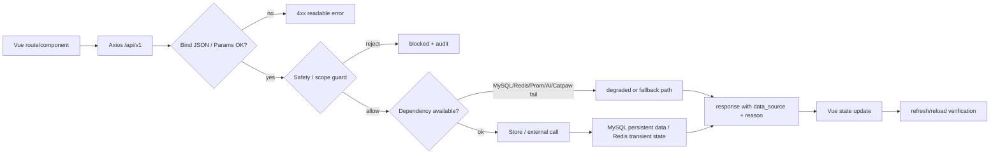
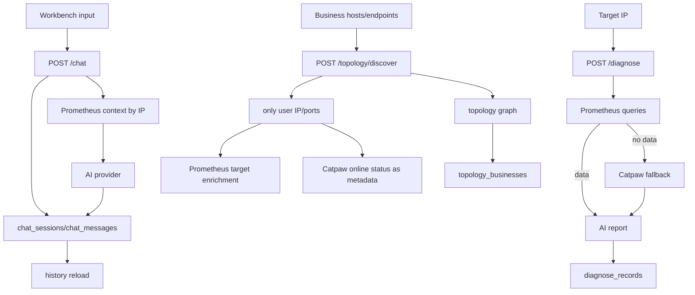
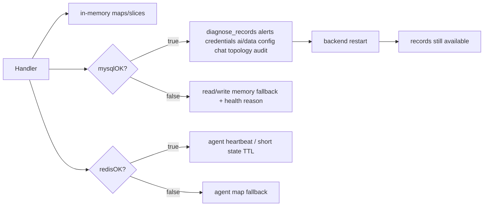

# AI WorkBench ????????

## 1. ???????

| ?? | ?? | ???? | ?????? |
|---|---|---|---|
| ???? | `web/src/router/index.js` | 7 ??????????? | ??????????????????????? |
| ???? | `web/src/store/index.js` + ? Vue ?? | ????????????????? | loading?selected?activeBusiness?showObservability?error message |
| API ?? | `api/main.go` | `/api/v1/*` REST API | Bind ??????????????????/?? |
| Handler | `api/internal/handler/*.go` | ??????Catpaw?????????????? | if/else?fallback???????????? |
| ???? | `api/internal/security/guard.go` | ?????????SSRF?test_batch_id | L3/L4?????????/???? |
| ??? | `api/internal/store/store.go` | MySQL ????Redis ???????? | mysqlOK/redisOK ???REPLACE/DELETE??? TTL?????? |
| ?? | `api/internal/handler/prometheus.go` | Prometheus/Categraf ??? IP ???? | instance/ident/ip/host/hostname/from_hostip/target ???? |

## 2. ????

## 3. ?????

## 4. ??????

| ?? | ?? | ?? | ??? | ??/?? |
|---|---|---|---|---|
| ?? | unknown | ????/??? | offline | unknown |
| ?? | installing | install-catpaw | online/reporting | failed + audit |
| ?? | online | heartbeat | online + Redis/Store updated | offline after timeout |
| ?? | reporting | catpaw/report | diagnose done | report rejected on invalid IP |
| ?? | uninstalling | uninstall-catpaw | removed/offline | blocked by safety guard |
| ?? | pending | POST /diagnose | running | failed bind/invalid IP |
| ?? | running | Prometheus query | done | Catpaw fallback / failed |
| ?? | done | DELETE /diagnose/:id | deleted | delete nonexistent still safe |
| ?? | firing | webhook/catpaw alert | firing persisted | bad payload rejected |
| ?? | diagnosing | alert AI diagnose | diagnose record linked | AI/Prom failure recorded |
| ?? | resolved | PUT /alerts/:id/resolve | resolved | nonexistent safe/no panic |
| ?? | created | POST /chat/sessions or first /chat | active/persisted | invalid JSON 400 |
| ?? | active | POST /chat | messages persisted | AI unavailable 502 with reason |
| ?? | persisted | refresh list/detail | restored | missing session 404 |
| ?? | renamed | PUT session | persisted renamed | empty title 400 |
| ?? | deleted | DELETE session | removed | repeated delete safe |
| ?? | business_created | save business | persisted | invalid node/edge 400 |
| ?? | scoped_discovery | discover | heuristic/ai_assisted graph | invalid scope 400 |
| ?? | saved | saveActive | MySQL persisted | DB unavailable memory fallback |
| ?? | deleted | delete business | graph removed | repeated delete safe |

## 5. ??????

## 6. Prometheus ????

| ???? | ?? | ???? | ??? |
|---|---|---|---|
| ???? | `/prometheus/hosts` | instance, ident, ip, host, hostname, from_hostip, target | ?? target ???????? |
| ???? | IP | same labels | CPU/load/mem/disk/io/net/tcp/process/JVM |
| ???? | ?? IP/?? | only scoped hosts | ????? target |
| ????? | Chat/Diagnose IP | same labels | AI ????????????? |

## 7. ?????

- JSON bind?? body???????????????Unicode/emoji?XSS/SQL/????????
- ????????? L3 ?????L4 ???SSRF ??/metadata ??????????????
- ????MySQL/Redis/Prometheus/AI Provider/Catpaw ???????????????
- ?????????????????????????????????
